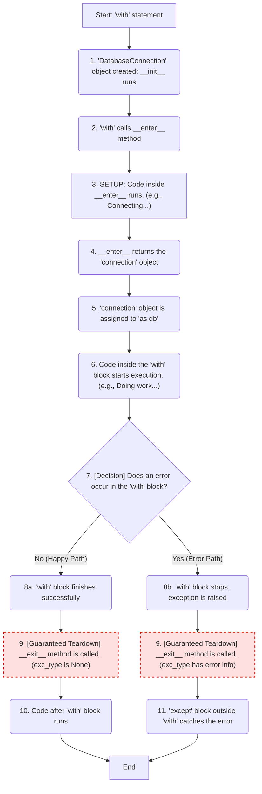
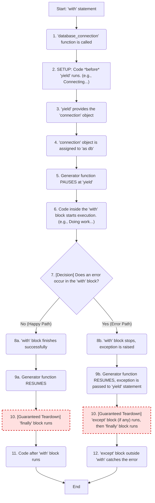

The `contextlib` module in Python provides utilities for working with **context managers**, which are the things you use with the `with` statement.

### The Purpose: "Setup" and "Teardown"

The main purpose of a context manager (and `contextlib`) is to **guarantee that a resource is properly set up and, more importantly, properly cleaned up (teardown), even if errors occur.**

Think of it as a "Try...Finally" block in a reusable package.

  * **Setup:** Acquiring a resource (e.g., opening a file, starting a database connection, acquiring a lock).
  * **Teardown:** Releasing the resource (e.g., closing the file, closing the database connection, releasing the lock).

The most common example is `with open(...)`, which ensures a file is *always* closed, even if your code inside the `with` block crashes.

### How `contextlib` Helps: The `@contextmanager` Decorator

Writing a context manager normally requires creating a full class with `__enter__` and `__exit__` methods, which is a lot of boilerplate.

The `contextlib.contextmanager` decorator is a powerful tool that lets you create a context manager from a simple **generator function** (a function that uses `yield`).

  * **Before `yield`:** All code is the "Setup" (`__enter__`).
  * **The `yield`:** The value yielded is what's given to the `as` variable.
  * **After `yield`:** All code is the "Teardown" (`__exit__`), and it's **guaranteed to run** (it's in a `finally` block).

-----

### Example: Class vs. `@contextmanager`

Let's imagine we have a simple database connection that we need to open and close.

#### 1\. The "Old Way" (A full class)



This is verbose, but it's what `@contextmanager` does for you.

```python
class DatabaseConnection:
    def __init__(self, db_name):
        self.db_name = db_name
        self.connection = None
        print(f"Initializing connection to {self.db_name}...")

    def __enter__(self):
        # --- SETUP ---
        print("Connecting to database...")
        self.connection = {"db": self.db_name, "status": "connected"}
        # Return the object for the 'as' variable
        return self.connection

    def __exit__(self, exc_type, exc_value, traceback):
        # --- TEARDOWN ---
        print("Closing database connection...")
        self.connection["status"] = "disconnected"
        
        # exc_type, exc_value, traceback are None if no error occurred
        if exc_type is not None:
            print(f"An error occurred: {exc_value}")
        
        # Return False to re-raise the exception, True to suppress it
        return False

# --- Using the class ---
print("--- Using the class ---")
try:
    with DatabaseConnection("my_app_db") as db:
        print(f"Doing work with {db['db']}...")
        raise ValueError("Something went wrong!")
except ValueError as e:
    print(f"Caught expected error: {e}\n")
```


#### 2\. The "New Way" (Using `contextlib`)



This is much cleaner, more Pythonic, and easier to read.

```python
from contextlib import contextmanager

@contextmanager
def database_connection(db_name):
    print(f"Initializing connection to {db_name}...")
    
    try:
        # --- SETUP ---
        print("Connecting to database...")
        connection = {"db": db_name, "status": "connected"}
        
        # --- YIELD ---
        # This is what's passed to the 'as' variable
        yield connection
        
    except Exception as e:
        print(f"An error occurred: {e}")
        # Re-raise the exception if you don't want to suppress it
        raise
        
    finally:
        # --- TEARDOWN (Guaranteed to run) ---
        print("Closing database connection...")
        connection["status"] = "disconnected"


# --- Using the generator ---
print("--- Using @contextmanager ---")
try:
    with database_connection("my_app_db_2") as db:
        print(f"Doing work with {db['db']}...")
        raise ValueError("Something went wrong!")
except ValueError as e:
    print(f"Caught expected error: {e}")
```

### Connection to FastAPI

This pattern is *exactly* how FastAPI's `Depends` works when you use `yield`\!

When you write a FastAPI dependency with `yield`, FastAPI treats it as a context manager:

  * Code *before* `yield` runs before your endpoint.
  * The `yield` provides the value to your endpoint function.
  * Code *after* `yield` (usually in a `finally` block) runs after the response is sent.

<!-- end list -->

```python
# This FastAPI pattern is inspired by contextlib!
async def get_db_session():
    db = SessionLocal()
    try:
        yield db  # SETUP: provides db to endpoint
    finally:
        db.close() # TEARDOWN: runs after response
```
